# 字体大小滑块交互“正反馈抖动死循环”问题分析与解决方案报告

## 一、 问题现象与本质定义

### 1. 现象描述
在应用的设置面板（`SettingsPanel.vue`）中，用户按住鼠标拖动“字号大小”滑动条（例如从 `16px` 向右拖动至 `18px`）时，出现以下反常现象：
- 滑块与鼠标光标之间出现高频剧烈晃动；
- 滑块数值在目标值与较小值之间反复跳跃；
- 用户向右拖动本意是调大字号，但 UI 放大后鼠标相对位置反而跑到滑块左侧，导致数值自动变小；数值变小后 UI 缩小，鼠标相对位置又跑到右侧促使数值变大，形成**无限循环振荡**。

### 2. 本质定义
这是一个典型的 **交互组件物理几何形变与输入事件构成的闭环正反馈振荡（Layout Mutation Feedback Loop / Hysteresis Oscillation）**。

---

## 二、 底层原理深度剖析（Root Cause Analysis）

### 1. CSS 尺寸级联机制
在 `src/stores/app.ts` 与 `src/assets/styles.css` 中：
1. `html` 根元素的字体大小由 CSS 变量动态驱动：
   ```css
   html {
     font-size: var(--app-font-size);
   }
   ```
2. 整个应用的弹窗、边距、输入框、控件宽度等普遍使用 `rem` 相对单位：
   - 弹窗卡片：`.modal-card { min-width: 28rem; max-width: min(46rem, 92vw); }`
   - 各项内边距：`padding: 0.75rem 1rem;`
   - 弹窗以视口绝对居中定位（`position: fixed; inset: 0; display: flex; align-items: center; justify-content: center;`）。

### 2. 坐标与事件触发时序推导

原生 `<input type="range">` 控件在浏览器中的取值计算方式如下：
$$\text{Value} = \text{Min} + \left( \frac{\text{PointerX} - \text{TrackLeft}}{\text{TrackWidth}} \right) \times (\text{Max} - \text{Min})$$

当用户在屏幕上按住鼠标并向右拖拽时，发生的连续时序如下：

```mermaid
sequenceDiagram
    autonumber
    actor User as 用户鼠标
    participant Slider as 滑动条控件 (<input type="range">)
    participant Store as App Store (app.patch)
    participant DOM as HTML 根元素 (--app-font-size)
    participant Layout as 浏览器布局引擎 (Reflow)

    User->>Slider: 向右拖动鼠标至 X=550px (意图: 16px -> 18px)
    Slider->>Store: 派发 @input 事件 (value = 18)
    Store->>DOM: 更新 --app-font-size = 18px
    DOM->>Layout: 触发全局重排 (Reflow)
    Layout-->>Slider: 弹窗因 rem 变大，居中重算后 TrackLeft 向左移、TrackWidth 变宽
    Note over Slider,User: 用户的物理鼠标依然在 X=550px<br/>但相对于变宽且左移的新轨道，相对比例变小！
    Slider->>Store: 浏览器判定当前位置应为 value = 15，派发 @input
    Store->>DOM: 更新 --app-font-size = 15px
    DOM->>Layout: 触发全局缩小重排
    Layout-->>Slider: 弹窗缩小，TrackLeft 右移，TrackWidth 变窄
    Note over Slider,User: 鼠标 X=550px 相对比例变大，再次触发 value = 18
    Note over User,Layout: 形成 60Hz/120Hz 的无限往复抖动与跳变死循环！
```



---

## 三、 解决方案对比与评估

针对此类“调节自身所在容器尺寸”的交互冲突，业界有以下几种成熟的设计与技术解决方案：

---

### 方案一：交互期与应用期解耦（拖拽结束生效 / 延迟应用）⭐【推荐度：高】

#### 核心机制
- 在拖拽滑动过程中，仅更新组件内部的本地预览状态（`localFontSize`），保持进度条视觉位置流畅跟随鼠标；
- 只有在用户松开鼠标（触发 `@change`）或拖拽结束时，才真正提交到全局状态库并修改 `--app-font-size`。
- 在滑块旁提供实时的文字大小预览样本（如 `Aa 18px`）。

```vue
<!-- 实现示例 -->
<input
  type="range"
  min="12"
  max="22"
  step="1"
  v-model.number="tempFontSize"
  @change="app.patch({ fontSize: tempFontSize })"
/>
<span class="value-badge">{{ tempFontSize }}px</span>
```

#### 优缺点分析
- **优点**：
  1. 完全切断了拖拽过程中的物理几何形变反馈环，拖拽过程绝对平滑、零抖动。
  2. 实现成本低，逻辑极其稳健，无任何副作用。
- **缺点**：
  - 拖拽瞬间无法看到背后整个软件界面的物理尺寸实时缩放（但可通过本地预览文字直观感知）。

---

### 方案二：设置面板（Modal）尺寸隔离与独立坐标系 ⭐【推荐度：极高】

#### 核心机制
- 全局字号调整仅影响主界面的内容与排版（SideNav、ArticleList、ArticleView 等），而**设置面板（`Modal` / `SettingsPanel`）自身的基础尺寸与坐标采用固定基准**（例如固定 `font-size: 15px` 或使用基于固定像素 `px` 的弹窗容器）。
- 这样，当用户拖动滑块时，背景的主界面会实时放大缩小（实时预览效果完美保留），而设置面板和滑块本身的物理尺寸和屏幕位置纹丝不动。

```css
/* 设置面板样式隔离 */
.modal-card {
  /* 显式隔离弹窗自身的基础字号，使其不受 html 动态字号缩放影响 */
  font-size: 15px;
  /* 使用固定 px 保证弹窗在屏幕中央的绝对稳定性 */
  min-width: 440px;
  max-width: min(720px, 92vw);
}
```

#### 优缺点分析
- **优点**：
  1. **体验最完美**：既消除了滑块抖动死循环，又能让用户在拖动过程中实时看到背景界面的实时缩放变化。
  2. 设置面板作为系统级对话框，保持固定的标准排版尺寸在视觉上更加精致可控。
- **缺点**：
  - 设置面板内部的文字大小不会随字号滑动而放大（但在通用桌面端设计规范中，设置窗口本身通常保持固定规范尺寸）。

---

### 方案三：拖拽生命周期内“几何尺寸冻结”（Freeze Layout on Drag）

#### 核心机制
- 当用户在滑块上按下鼠标（`pointerdown`）时，通过 JS 读取当前弹窗的 `getBoundingClientRect()`，并将宽度/高度临时锁定为固定 `px` 值；
- 拖拽期间全局字号可以实时生效（`@input` 实时触发）；
- 当用户松开鼠标（`pointerup` / `window.onpointerup`）时，解除尺寸锁定，恢复为 `rem` 弹性布局。

#### 优缺点分析
- **优点**：
  - 既能让设置面板随最终字号改变，又在拖拽瞬间消除了抖动。
- **缺点**：
  - 需要手动监听全局 `pointerup` 事件，存在事件未正常释放的边界情况，逻辑复杂度相对较高。

---

### 方案四：辅助微调步进器（+/- 按钮及离散刻度点）

#### 核心机制
- 许多现代桌面操作系统（如 macOS 辅助功能、iOS 设置）对于关键字号调节，除了提供滑块外，还会提供两端的 `A-` / `A+` 步进按钮或点选刻度（Discrete Segmented Steps）。
- 点击步进按钮为单次瞬时离散触发，完全不会产生鼠标与轨道的相对位移问题。

---

## 四、 推荐实施方案（综合最优实践）

综合用户体验、视觉规范与系统稳定性，**最佳组合方案为「方案二（弹窗尺寸隔离）+ 方案一（双重保险）」**：

1. **设置弹窗样式隔离（`Modal.vue` / `SettingsPanel.vue`）**：
   - 显式为 `.modal-card` 设置固定基准字号 `font-size: 15px;`，并使用固定的像素/固定比例定义弹窗尺寸与间距。
   - 使得设置面板具备独立的尺寸上下文，主界面实时响应字号变化，而滑块自身的屏幕物理位置保持绝对稳定。
2. **滑块控件优化**：
   - 在滑动条两侧添加 `A-` / `A+` 步进按钮，方便精准微调；
   - 在滑动条下方或右侧展示实时的字号数值标签与预览。

---

## 五、 总结结论

该问题的根源在于**“修改目标同时反噬修改源的物理坐标”**。通过将弹窗布局与全局动态字号进行尺寸解耦，即可彻底根治死循环抖动，同时带来更加稳定优雅的设置体验。
