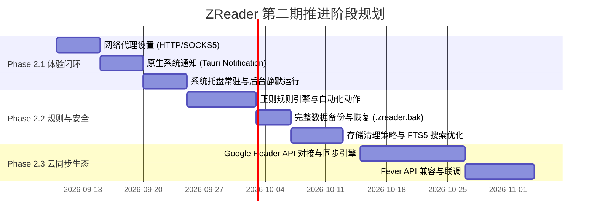

# ZReader 第二期（Phase 2）路线图与技术设计方案

> **文档版本**：v1.1.0  
> **创建日期**：2026-09-02  
> **状态**：Phase 2.1 + 2.2 已实施（v0.2.0，2026-09-03）；Phase 2.3 云同步待启动  
> **基线版本**：ZReader v0.1.2（第一期 MVP 稳定版）

---

## 一、 总体愿景与定位

ZReader 第一期完成了基于 **Rust + Tauri 2 + Vue 3** 的现代化桌面 RSS 阅读器核心架构（本地 SQLite 存储、Feed 抓取与解析、Ammonia/Readability 阅读视图、Fluent UI 与多视图模式）。

**第二期（Phase 2）的核心目标**：
1. **打破信息孤岛**：打通与主流第三方云端 RSS 服务的双向同步（Google Reader API、Fever）；
2. **构建智能过滤**：复刻并增强原版 Fluent Reader 广受好评的“正则自动化规则引擎”；
3. **完善桌面原生体验**：补齐系统代理配置、原生桌面通知、系统托盘常驻、完整数据备份与 SQLite FTS5 本地全文搜索。

```mermaid
graph TB
    subgraph Core["ZReader Core (Rust + Tauri 2)"]
        DB[(SQLite / WAL + FTS5)]
        ReqwestClient[Reqwest Client w/ Proxy]
        SyncEngine[Sync Engine (GReader/Fever)]
        RuleEngine[Regex Rule Engine]
        NotifyService[Notification & Tray Service]
    end

    subgraph External["外部服务与网络"]
        RSSFeeds[RSS / Atom / JSON Feeds]
        CloudRSS[FreshRSS / Miniflux / Inoreader]
        OSNotify[OS Desktop Notification]
    end

    subgraph Frontend["Vue 3 Fluent Frontend"]
        Views[Cards / Magazine / List]
        SettingsUI[Settings Panel & Rule Editor]
        SearchBar[Instant Search Bar]
    end

    RSSFeeds --> ReqwestClient
    CloudRSS <--> SyncEngine
    ReqwestClient --> DB
    SyncEngine <--> DB
    DB --> RuleEngine
    RuleEngine --> NotifyService
    NotifyService --> OSNotify
    DB <--> Frontend
    SettingsUI --> SyncEngine
    SettingsUI --> RuleEngine
```

---

## 二、 核心功能模块设计与技术方案

### 1. ☁️ 云端同步服务（Cloud Sync Services）

#### 1.1 协议支持范围
* **Google Reader API (GReader API)**：支持 FreshRSS、Miniflux、Inoreader、Feedbin、Bazqux 等（通过标准 `/accounts/ClientLogin`、`/reader/api/0/...` 协议）。
* **Fever API**：支持 Tiny Tiny RSS（Fever 插件）、FreshRSS（Fever 模拟）。

#### 1.2 技术设计要点
* **同步策略**：
  * **增量同步（Incremental Sync）**：基于 `continuation` token 或 `since_id` / 时间戳拉取变更。
  * **状态上报队列（Action Queue）**：本地标记已读、标星等操作在断网时暂存 SQLite 队列，联网后批量同步至云端。
  * **冲突解决**：采用最后写入者获胜（LWW, Last-Write-Wins）或以云端 ID 映射本地 GUID。
* **数据模型扩展（Rust）**：
  ```rust
  pub enum SyncProviderType {
      Local,
      GoogleReader,
      Fever,
  }

  pub struct SyncAccount {
      pub provider: SyncProviderType,
      pub server_url: String,
      pub username: String,
      pub auth_token: Option<String>,
      pub last_sync_ts: i64,
  }
  ```

---

### 2. ⚡ 正则过滤规则引擎（Regex Rules Engine）

#### 2.1 功能概述
在文章抓取入库阶段（或手动批量触发时），基于用户预定义的规则，对文章的 `title`、`content`、`summary`、`author`、`source_url` 进行正则表达式匹配并执行自动化动作。

#### 2.2 动作类型（Actions）
* **自动已读（Auto Mark as Read）**：对广告、低质通知或不感兴趣的话题自动标记已读。
* **自动标星（Auto Star）**：对关键词（如招聘、重磅发布、关注的主题）自动加入收藏。
* **静默屏蔽/隐藏（Auto Hide）**：不进入阅读列表或自动从列表中过滤。
* **优先通知（Trigger Notification）**：匹配特定规则时强制触发系统通知。

#### 2.3 数据库结构设计
```sql
CREATE TABLE IF NOT EXISTS regex_rules (
    id INTEGER PRIMARY KEY AUTOINCREMENT,
    name TEXT NOT NULL,
    pattern TEXT NOT NULL,
    target_field TEXT NOT NULL, -- 'title' | 'content' | 'author' | 'source_url' | 'any'
    action_type TEXT NOT NULL,  -- 'mark_read' | 'star' | 'hide' | 'notify'
    is_case_sensitive BOOLEAN NOT NULL DEFAULT 0,
    is_enabled BOOLEAN NOT NULL DEFAULT 1,
    source_scope TEXT DEFAULT 'all', -- 'all' 或限定 source_id / group_id
    created_at INTEGER NOT NULL
);
```

#### 2.4 执行时机
在 `src-tauri/src/feed.rs` 的 `fetch_feed_and_save` 流程中：
1. 解析 Feed 得到 `Vec<Item>`；
2. 批量匹配内存中缓存的高效编译正则（`regex::RegexSet`）；
3. 根据命中规则就地打上 `has_been_read = true`、`starred = true` 标签后再批量事务入库。

---

### 3. 🌐 网络代理与连接增强（Proxy & Connectivity）

#### 3.1 痛点
国内外网络环境下，Medium、Twitter/X RSS、Substack、GitHub 等订阅源以及 Readability 网页抓取常出现连接超时或 DNS 污染。

#### 3.2 技术方案
* **代理协议支持**：HTTP / HTTPS / SOCKS5 代理。
* **配置模式**：
  1. **跟随系统（System Default）**：自动读取操作系统代理环境变量（`HTTP_PROXY` / `HTTPS_PROXY`）。
  2. **手动指定（Manual Proxy）**：用户配置 `host:port` 与可选的鉴权凭证（Username/Password）。
  3. **PAC / 自动路由（可选演进）**。
* **Rust 客户端集成（`reqwest`）**：
  ```rust
  pub fn build_http_client(settings: &Settings) -> reqwest::Client {
      let mut builder = reqwest::Client::builder()
          .user_agent("Mozilla/5.0 (Windows NT 10.0; Win64; x64) ZReader/0.2")
          .timeout(std::time::Duration::from_secs(30));
      
      if let Some(proxy_url) = &settings.proxy_url {
          if let Ok(proxy) = reqwest::Proxy::all(proxy_url) {
              builder = builder.proxy(proxy);
          }
      }
      builder.build().unwrap_or_default()
  }
  ```

---

### 4. 🔔 原生系统通知与托盘常驻（Notification & System Tray）

#### 4.1 系统原生通知
* 引入 Tauri 2 官方插件 `@tauri-apps/plugin-notification`。
* 在后台定时刷新任务（lib.rs）完成时，若有新增未读文章（或命中加星/通知规则的文章）：
  * 弹出聚合通知（如：“*ZReader: 获取到 12 篇新文章*”）。
  * 点击通知可激活并唤起应用主窗口，自动定位到对应文章或未读视图。

#### 4.2 系统托盘（System Tray）
* 支持托盘图标右键菜单：
  * **立即刷新所有订阅**
  * **全部标记已读**
  * **显示主窗口 / 退出**
* 支持窗口“关闭即最小化到托盘”，保持后台静默定时抓取。
* 托盘图标未读数红点徽标（Badge）。

---

### 5. 💾 完整数据备份与恢复（Full Backup & Restore）

#### 5.1 范围对比
| 备份类型 | 包含内容 | 适用场景 |
| :--- | :--- | :--- |
| **OPML（第一期已支持）** | 订阅源 URL、分组结构、标题 | 跨阅读器迁移源列表 |
| **完整备份（第二期目标）** | 全部历史文章、收藏标星记录、自定义快捷键、正则规则、分组、偏好设置 | 换机迁移、灾备还原、本地快照 |

#### 5.2 技术实现
* **导出**：生成 `.zreader.bak`（或 `.zip` 压缩包），打包 SQLite DB 文件快照与 `settings.json`。
* **恢复**：导入备份包前执行完整性校验，确认无误后替换数据并触发前端状态全量重载。

---

### 6. 🔍 性能与存储优化（FTS5 全文搜索与生命周期管理）

#### 6.1 SQLite FTS5 本地毫秒级搜索
* 在 SQLite 中启用 `FTS5` 虚拟表模块（支持 unicode61 分词）。
* 对文章标题、摘要、正文建立倒排索引，支持上万篇离线文章即时高亮检索。

#### 6.2 存储生命周期管理（Data Retention Policy）
* 提供设置选项：
  * 自动清理 N 天前未收藏的已读文章（如 30 天 / 90 天 / 从不）。
  * 限制每个源最大保留文章数（如 500 篇）。
* 定期触发 SQLite `VACUUM`，防止本地数据库体积膨胀。

---

## 三、 实施阶段划分与落地路线



### 阶段建议：

1. **Phase 2.1（快速见效）**：
   * 优先实现 **网络代理配置** + **原生桌面通知** + **系统托盘**。
   * 开发周期短，能即刻改善用户抓取失败率和后台常驻体验。
2. **Phase 2.2（核心能力增强）**：
   * 攻坚 **正则自动化规则引擎** 与 **完整数据备份恢复**。
   * 补齐 Fluent Reader 最具特色的自动化能力。
3. **Phase 2.3（生态互通）**：
   * 落地 **Google Reader API 与 Fever 同步引擎**。
   * 解决多端（手机端与电脑端）阅读进度同步问题。

---

## 四、 总结

第二期路线图在保持 Tauri 2 + Rust 超轻量、低内存占用优势的前提下，补齐了从“单机本地阅读器”迈向“专业级自动化与多端同步 RSS 终端”的关键拼图。
